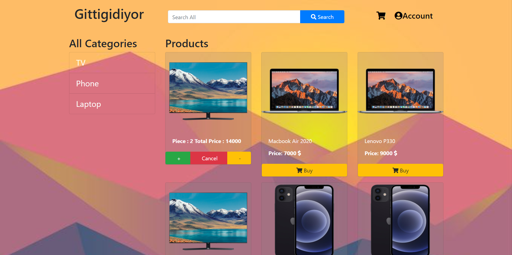

[](https://app.netlify.com/sites/awesome-dijkstra-f36b71/deploys)

# New Shopping Market Clone

<br>
<br>
<p>
    
</p>

### vue-components

> A Vue.js project

### Build Setup

``` bash
# install dependencies
npm install

# serve with hot reload at localhost:8080
npm run dev

# build for production with minification
npm run build
```
